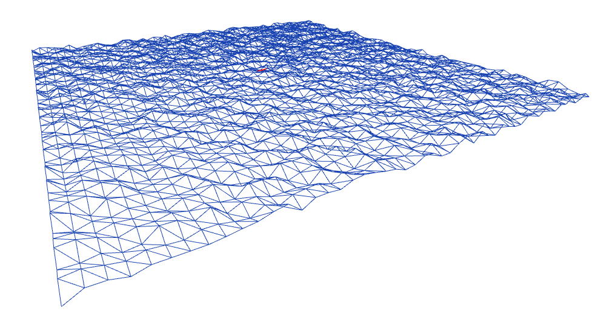

# terrain7

  

A three-js terrain editor.

## Summary

- [terrain7](#terrain7)
  - [Summary](#summary)
  - [Screenshots](#screenshots)
  - [Context](#context)

## Screenshots

  

## Context

I am an engineering student at [ENSEEIHT](https://www.enseeiht.fr/fr/index.html).
As part of my summer internship, I am working on a project to create a terrain editor.
