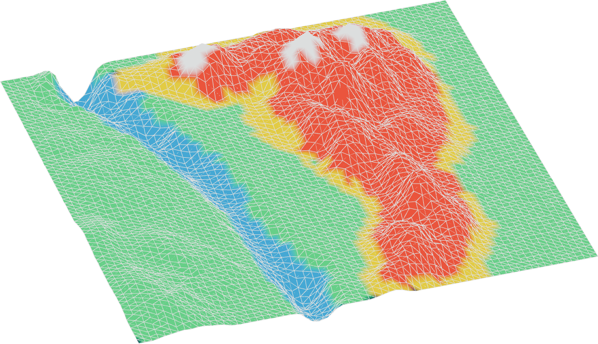

<!-- omit in toc -->
# 

A three-js terrain editor.

<!-- omit in toc -->
## Summary

- [Screenshots](#screenshots)
- [Context](#context)
- [License](#license)

## Screenshots

  

## Context

I am an engineering student at [ENSEEIHT](https://www.enseeiht.fr/fr/index.html).
As part of my summer internship, I am working on a project to create a terrain editor.

## License
